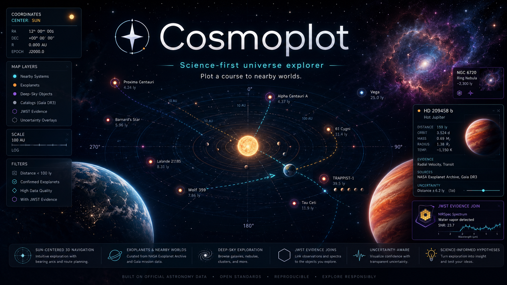

# Cosmoplot

A science-first, Sun-centered map of nearby worlds. Cosmoplot plots real exoplanet systems in 3D from live NASA data, then derives the physics of each world (interior, atmosphere, climate, escape, detectability) from published relations, with the provenance of every number kept visible.

**Live:** [cosmoplot.vercel.app](https://cosmoplot.vercel.app)

[](https://nextjs.org)
[](https://react.dev)
[](https://www.typescriptlang.org)
[](https://docs.pmnd.rs/react-three-fiber)
[](https://exoplanetarchive.ipac.caltech.edu)

<p align="center">
  
</p>
<p align="center"><em>The Dream (WIP): a concept for where the interface is headed, not a screenshot of the current build. The star-compass mark to the left of the wordmark is the Cosmoplot logo and favicon.</em></p>

## Contents

- [What it is](#what-it-is)
- [Features](#features)
- [How it works](#how-it-works)
- [The astrophysics](#the-astrophysics)
- [Data and provenance](#data-and-provenance)
- [Tech stack](#tech-stack)
- [Project structure](#project-structure)
- [Getting started](#getting-started)
- [Scientific integrity](#scientific-integrity)
- [Citing Cosmoplot](#citing-cosmoplot)
- [License](#license)
- [References](#references)
- [Acknowledgements](#acknowledgements)

## What it is

Cosmoplot is a web app that turns the NASA Exoplanet Archive into a navigable star chart. You start at the Sun, fly out to real systems positioned by their measured coordinates, select a planet, and read a derived science profile for it: what it is likely made of, whether it sits in its star's habitable zone, how hard it is to keep an atmosphere, what a transmission spectrum would imply, and how detectable its heat is to JWST.

Two rules shape the whole project:

1. **Numeric truth stays with the source.** Physical parameters come from the NASA Exoplanet Archive. Everything Cosmoplot computes is derived from those values using published relations, and is labeled as derived, not observed.
2. **Every claim carries its provenance.** Observed, derived, inferred, proxy, and artistic values are kept distinct in the UI, so a rendered planet is never mistaken for a photograph and a population estimate is never mistaken for a measurement.

## Features

- **3D nearby-worlds map.** Real systems placed by right ascension, declination, and distance, navigable from a heliocentric origin.
- **Per-planet science profile.** Interior composition, habitable-zone placement, Earth similarity, atmospheric escape regime, transmission-spectrum inference, and thermal emission, each computed on demand.
- **Uncertainty that propagates.** Measurement error bars are carried through a Monte Carlo so derived quantities come with 16th/50th/84th percentile intervals, not false-precision point values.
- **Researched systems.** 25 systems (27 planets) ship with committed deep-dive analyses covering formation, interior, magnetosphere/chemistry, and long-term evolution.
- **Real JWST spectra.** Reduced transmission spectra (via MAST) are plotted for supported targets rather than illustrative stand-ins.
- **White-dwarf mode.** Degenerate mass-radius physics anchored on the Tremblay et al. (2019) sample and named benchmarks (Sirius B, Procyon B, 40 Eridani B, van Maanen's star).
- **Observation target planner.** A native optimizer proposes a non-redundant target slate by treating it as a MaxCut over utility and redundancy.

## How it works

```
NASA Exoplanet Archive (TAP: pscomppars)
    |   live query, 12h cache, controversial rows filtered out
    v
Typed archive rows  -->  Science engine (deterministic, src/lib/science)
    |                         positions, luminosity, temperature, interior,
    |                         habitability, escape, spectra, and Monte Carlo
    |                         uncertainty propagation
    v
API routes (/api/science/*)  -->  Typed science bundle
    |                              (observed | derived | inferred | proxy)
    v
React Three Fiber scene + detail panels  (rendering is downstream of the typed model)
```

The science engine is pure and deterministic: given the same archive inputs it produces the same outputs, and it never invents a number the archive did not provide. Rendering reads a typed appearance model, so the visuals are an evidence-constrained interpretation of the data, not a claim about how a planet looks.

### Value tiers

Every value shown belongs to one tier, and the tier is surfaced next to it:

| Tier | Meaning | Example |
| --- | --- | --- |
| Observed | Straight from the archive | Planet radius, orbital period, host T_eff |
| Derived | Computed from observed values by a physical law | Bulk density, surface gravity, equilibrium temperature |
| Inferred | Estimated from a population relation or model | Interior composition class, forecast mass from radius |
| Proxy | A deliberately simplified stand-in for a hard quantity | Magnetosphere strength, energy-limited loss proxy |
| Artistic | Rendering choice with no observational claim | Surface texture, corona glow |

## The astrophysics

Cosmoplot implements standard, published relations. This section states what each one does and cites the source; the implementations live in [`src/lib/science/physics.ts`](src/lib/science/physics.ts).

### Positions and the 3D map

Each system is placed by converting equatorial coordinates and distance to a heliocentric Cartesian position in parsecs:

```
x = d cos(dec) cos(ra),  y = d sin(dec),  z = d cos(dec) sin(ra)
```

Archive coordinates are ICRS (J2000), so the map is in a heliocentric equatorial frame. Distances span many orders of magnitude, so display positions are compressed with a logarithmic radial scale while preserving direction, keeping both the solar neighborhood and more distant systems legible in one scene.

### Stellar luminosity and flux

Luminosity follows the Stefan-Boltzmann law, `L/L_sun = (R/R_sun)^2 (T_eff / 5772)^4`, using the archive log-luminosity when present and falling back to radius and temperature otherwise. Incident flux is the inverse-square insolation `L / a^2`, normalized to Earth's `1361 W/m^2`.

### Equilibrium temperature and thermal emission

The archive equilibrium temperature assumes full day-night heat redistribution. Cosmoplot also reports the dayside temperature with no redistribution, hotter by `(8/3)^0.25`, and the substellar peak, hotter by `sqrt(2)` [Cowan & Agol 2011]. Wien's displacement law gives the thermal peak wavelength, and the secondary-eclipse depth is the planet-to-star flux ratio from Planck functions at a MIRI reference wavelength (15 microns), a blackbody detectability estimate rather than a spectral model.

### Mass, radius, density, gravity

Bulk density and surface gravity are derived directly from mass and radius, normalized so Earth returns its familiar values (`5.51 g/cm^3`, `9.807 m/s^2`).

### Interior composition

Composition class is read from the mass-radius point against the reference curves of Zeng, Sasselov & Stewart (2016), `R/R_earth = C (M/M_earth)^(1/3.7)`, with `C` set by composition: pure iron `0.86`, Earth-like `1.00`, pure rock `1.07`, and water-rich coefficients above that. This is a bulk inference over roughly 0.1 to 20 Earth masses; larger bodies are flagged as giants. Because a single mass-radius point hides real ambiguity (rocky versus water-world), Cosmoplot also runs a Monte Carlo over the measurement errors and reports the probability of each composition class [Zeng et al. 2016].

### Mass forecasting from radius

For planets with a measured radius but no measured mass, Cosmoplot forecasts mass from an empirical mass-radius power law fit by least squares over 41 archive planets, `log10(M) = 0.0384 + 1.9565 log10(R)`, with 0.27 dex scatter, in the spirit of the probabilistic forecaster of Chen & Kipping (2017). The single power law flattens for giants, where radius barely tracks mass, so the estimate is flagged as unreliable there.

### Habitable zone

Habitable-zone boundaries follow the stellar-flux limits of Kopparapu et al. (2013), with `S_eff` a quartic in `(T_eff - 5780 K)` and the boundary distance `d = sqrt((L/L_sun) / S_eff)`. The conservative zone runs from the runaway greenhouse to the maximum greenhouse; the optimistic zone from recent Venus to early Mars. Hosts outside the 2600 to 7200 K calibration range are flagged as extrapolated [Kopparapu et al. 2013].

### Earth Similarity Index

The Earth Similarity Index of Schulze-Makuch et al. (2011) scores a planet from 0 to 1 over radius, bulk density, escape velocity, and equilibrium temperature, each weighted, split into an interior and a surface component. Equilibrium temperature is used consistently against an Earth reference of 255 K so Earth itself scores 1.0. It is a similarity score, not a habitability probability [Schulze-Makuch et al. 2011].

### Atmospheric escape and retention

Escape is screened with the Jeans parameter evaluated at the exobase (the base of the collisionless exosphere), not the surface, using an isothermal-exosphere approximation at the equilibrium temperature:

```
lambda = G M m / (k_B T r_exo)
```

Cosmoplot reports escape velocity `sqrt(2GM/R)`, the thermal speed `sqrt(3 k_B T / m)`, and Jeans parameters for both a light (H2-dominated) and a heavy (N2-like) envelope, separating whether a world can hold a primordial hydrogen envelope from whether it can hold a heavier secondary atmosphere. The result is an escape-regime screen, not a measurement that an atmosphere exists today.

### Transmission spectroscopy

Given a transmission-spectrum feature amplitude, Cosmoplot inverts scale-height physics to infer the mean molecular weight. The scale height is `H = k_B T / (mu g)`, and a strong molecular band spans about two scale heights, so the transit-depth modulation is `dDepth ~ N_H (2 H R_p / R_star^2)`. Inverting gives `H`, then `mu`, which separates a light hydrogen/helium primary atmosphere (large scale height, deep features) from a heavy or cloudy one (small scale height, muted features). This is a scale-height screen, not a full Bayesian radiative-transfer retrieval. Supported targets are plotted against real reduced JWST spectra retrieved from MAST.

### White dwarfs

White-dwarf mode uses the degenerate mass-radius relation of Nauenberg (1972), including the relativistic turnover toward the Chandrasekhar mass (`mu_e = 2` for a carbon-oxygen composition gives `M_ch = 1.44 M_sun`). Model curves are shown against the real Tremblay et al. (2019) Gaia mass-radius sample and named benchmarks.

### Uncertainty propagation

Rather than reporting single derived values, Cosmoplot draws each input from its archive error bars (or a labeled fallback width when the archive gives none) with a seeded Gaussian sampler, recomputes the full derived chain per draw, and summarizes the 16th, 50th, and 84th percentiles. The seed is per planet, so intervals are reproducible.

### Observation target planner

The target planner frames slate selection as a graph problem: nodes are candidate targets weighted by observational utility, edges connect redundant pairs (same system, similar spectral type, similar thermal class), and a MaxCut separation favors a diverse, non-redundant slate. It runs natively in-process with a greedy pass and a simulated-annealing refinement [Kirkpatrick et al. 1983], with no external solver.

## Data and provenance

| Source | Use | Reference |
| --- | --- | --- |
| NASA Exoplanet Archive (TAP, `pscomppars`) | Live planet and host parameters, positions | [Archive](https://exoplanetarchive.ipac.caltech.edu); Akeson et al. (2013) |
| JWST reduced transmission spectra (MAST) | Real spectra for supported targets | [MAST](https://mast.stsci.edu) |
| Tremblay et al. (2019) | White-dwarf mass-radius sample | [ADS](https://ui.adsabs.harvard.edu/abs/2019MNRAS.482.5222T) |
| NASA Science, SIMBAD | Named white-dwarf benchmarks | [SIMBAD](https://simbad.cds.unistra.fr) |

Archive queries filter out controversial rows (`pl_controv_flag = 0`) and cache for 12 hours. Cosmoplot is an independent project and is not affiliated with or endorsed by NASA, IPAC/Caltech, or STScI.

Required acknowledgements:

> This research has made use of the NASA Exoplanet Archive, which is operated by the California Institute of Technology, under contract with the National Aeronautics and Space Administration under the Exoplanet Exploration Program.

> Some of the data presented here were obtained from the Mikulski Archive for Space Telescopes (MAST) at the Space Telescope Science Institute.

## Tech stack

- **Framework:** Next.js 16 (App Router), React 19, TypeScript (strict)
- **3D:** three.js via `@react-three/fiber` and `@react-three/drei`
- **State and validation:** Zustand, Zod
- **UI:** Tailwind CSS, `motion`, `lucide-react`, `react-markdown` + `remark-gfm`
- **Platform:** Vercel (Fluid Compute), Vercel Analytics and Speed Insights

## Project structure

```
src/
  app/
    api/science/{universe,planet,white-dwarfs,optimize}/  # science endpoints
    api/leads/                                            # contact intake
    layout.tsx  page.tsx
  lib/science/
    physics.ts               # published relations (this README's science section)
    coordinates.ts           # equatorial -> heliocentric Cartesian
    catalog/build-universe.ts # snapshot assembly
    official/                # NASA archive + per-planet science bundle
    local/                   # researched systems, spectra, white dwarfs
    optimization/            # MaxCut target planner
    types.ts
  components/
    universe/                # the 3D stage and detail panels
    ui/ chrome/ science/
data/science/
  analyses/                  # 25 researched systems, committed deep-dives
  spectra/                   # reduced JWST spectra
  white-dwarfs/              # Tremblay et al. (2019) sample
```

## Getting started

Requirements: Node.js 20+ and npm.

```bash
npm install
npm run dev          # http://localhost:3000
```

The core map works with no configuration; it queries the public NASA Exoplanet Archive directly.

### Environment (optional)

Nothing is required for the 3D map and science profiles. A few features read optional variables, all safe to omit:

- **Contact intake:** `RESEND_API_KEY`, `COSMOPLOT_LEADS_TO`, `COSMOPLOT_LEADS_FROM` (email delivery), or `COSMOPLOT_LEAD_WEBHOOK_URL` (post to a webhook instead).
- **Support link:** `NEXT_PUBLIC_DONATION_URL`.
- **JWST spectra fetch:** `MAST_TOKEN` for authenticated MAST requests.

Additional `COSMOPLOT_*` toggles exist for loading local datasets during development.

Scripts:

```bash
npm run dev        # start the dev server
npm run build      # production build
npm run start      # serve the production build
npm run lint       # eslint
npm run typecheck  # tsc --noEmit
npm run verify     # lint (no warnings) + typecheck + build
```

## Scientific integrity

Cosmoplot is built to be honest about what it knows:

- Derived and inferred values are labeled as such and never presented as measurements.
- Screens (interior class, atmosphere inference, escape regime) are described as screens, with their assumptions stated inline, not as retrievals or detections.
- Uncertainty is propagated and shown as intervals.
- Renderings are interpretation. A glowing planet is an artistic tier value, not an observation.

If you find a relation misapplied or a value mislabeled, that is a bug worth reporting.

## Citing Cosmoplot

If Cosmoplot is useful in your work, a citation is welcome. Machine-readable metadata is in [`CITATION.cff`](CITATION.cff) (GitHub renders a "Cite this repository" button from it); an archival DOI via Zenodo is planned. Please also cite the primary data and method sources in the [References](#references). The astrophysical results belong to the cited authors, not to Cosmoplot.

## License

Released under the [MIT License](LICENSE). The astrophysical relations and datasets carry the terms and attribution of their own authors and archives (see [References](#references) and [Data and provenance](#data-and-provenance)).

## References

- Akeson, R. L., et al. (2013). The NASA Exoplanet Archive. *PASP* 125, 989. [ADS](https://ui.adsabs.harvard.edu/abs/2013PASP..125..989A)
- Chen, J., & Kipping, D. (2017). Probabilistic Forecasting of the Masses and Radii of Other Worlds. *ApJ* 834, 17. [ADS](https://ui.adsabs.harvard.edu/abs/2017ApJ...834...17C)
- Cowan, N. B., & Agol, E. (2011). The Statistics of Albedo and Heat Recirculation on Hot Exoplanets. *ApJ* 729, 54. [ADS](https://ui.adsabs.harvard.edu/abs/2011ApJ...729...54C)
- Kirkpatrick, S., Gelatt, C. D., & Vecchi, M. P. (1983). Optimization by Simulated Annealing. *Science* 220, 671. [ADS](https://ui.adsabs.harvard.edu/abs/1983Sci...220..671K)
- Kopparapu, R. K., et al. (2013). Habitable Zones around Main-sequence Stars. *ApJ* 765, 131. [ADS](https://ui.adsabs.harvard.edu/abs/2013ApJ...765..131K)
- Nauenberg, M. (1972). Analytic Approximations to the Mass-Radius Relation and Energy of Zero-Temperature Stars. *ApJ* 175, 417. [ADS](https://ui.adsabs.harvard.edu/abs/1972ApJ...175..417N)
- Schulze-Makuch, D., et al. (2011). A Two-Tiered Approach to Assessing the Habitability of Exoplanets. *Astrobiology* 11, 1041. [ADS](https://ui.adsabs.harvard.edu/abs/2011AsBio..11.1041S)
- Tremblay, P.-E., et al. (2019). Gaia white dwarfs within 40 pc. *MNRAS* 482, 5222. [ADS](https://ui.adsabs.harvard.edu/abs/2019MNRAS.482.5222T)
- Zeng, L., Sasselov, D. D., & Stewart, S. T. (2016). Mass-Radius Relation for Rocky Planets. *ApJ* 819, 127. [ADS](https://ui.adsabs.harvard.edu/abs/2016ApJ...819..127Z)

## Acknowledgements

This project relies on the NASA Exoplanet Archive, operated by Caltech/IPAC under contract with NASA, and on data products from the Mikulski Archive for Space Telescopes (MAST) at STScI. The astrophysics is the work of the authors cited above; any misapplication of it here is ours.
